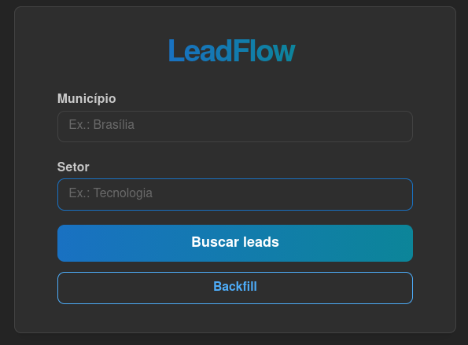
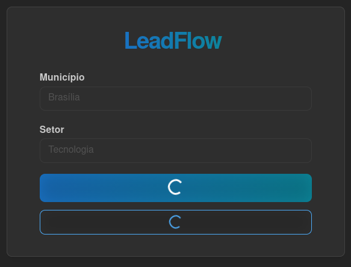
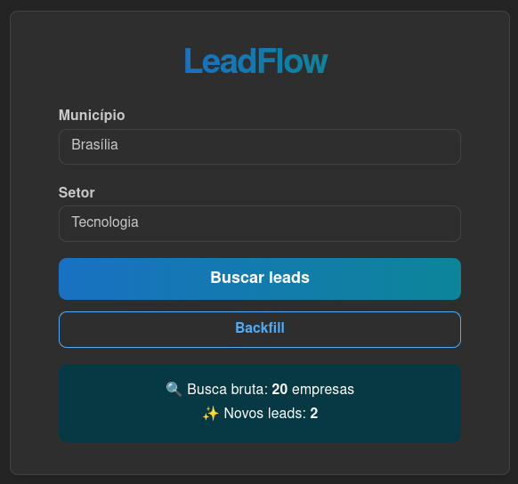
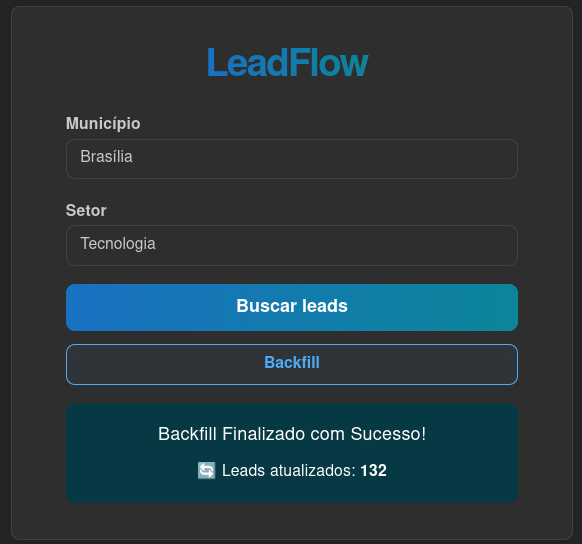
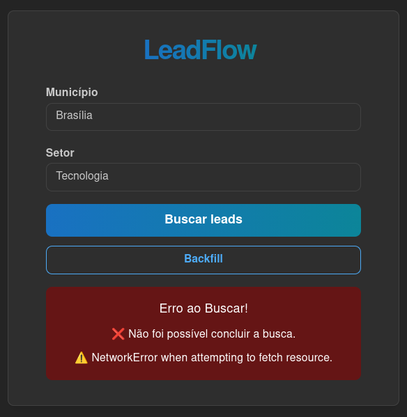

# LeadFlow

**Pipeline inteligente para prospecção de empresas e geração de leads.**

O **LeadFlow** automatiza uma parte do processo de prospecção: coleta empresas a partir de buscas locais, normaliza e deduplica os resultados, enriquece os dados, classifica leads com IA e persiste as informações em uma base centralizada.

Atualmente, o projeto combina **SerpAPI + Python + FastAPI + React + Mantine + Google Sheets + Gemini**.

> 🚧 **Status: MVP funcional**

---

## Demonstração

### Interface



### Busca em execução



### Busca concluída



### Backfill concluído



### Tratamento de erros



---

## O que o LeadFlow faz?

O fluxo principal começa com dois parâmetros:

```text
Município + Segmento
```

A partir deles, o sistema:

1. Consulta a SerpAPI utilizando resultados locais do Google.
2. Compara os resultados com empresas já armazenadas.
3. Remove duplicatas do histórico e do próprio lote.
4. Normaliza os dados encontrados.
5. Resolve e valida websites.
6. Constrói objetos `Lead`.
7. Classifica os leads com IA.
8. Salva apenas os novos leads no Google Sheets.

O sistema também possui um **Backfill**, responsável por reprocessar leads já existentes e preencher dados que ficaram incompletos, como score/justificativa da IA e websites.

---

# Arquitetura

A aplicação está organizada em três camadas principais:

```text
                    ┌──────────────────────┐
                    │      Frontend        │
                    │   React + Mantine    │
                    └──────────┬───────────┘
                               │
                               │ HTTP
                               ▼
                    ┌──────────────────────┐
                    │       FastAPI        │
                    │       REST API       │
                    └──────────┬───────────┘
                               │
                               ▼
                    ┌──────────────────────┐
                    │    LeadFlow Core     │
                    └──────────┬───────────┘
                               │
              ┌────────────────┼────────────────┐
              ▼                ▼                ▼
        ┌──────────┐    ┌──────────────┐   ┌──────────────┐
        │  SerpAPI │    │DataProcessor │   │ Google Sheets│
        └──────────┘    └───────┬──────┘   └──────────────┘
                                │
                                ▼
                          ┌───────────┐
                          │ LeadScorer│
                          │    IA 🤖  │
                          └───────────┘
```

### Fluxo de busca

```text
Usuário
   │
   │ Município + Segmento
   ▼
React
   │
   │ POST /leads
   ▼
FastAPI
   │
   ▼
LeadCollector
   │
   ▼
SerpAPI / Google Local
   │
   ▼
Dados brutos
   │
   ▼
DataProcessor
   │
   ├── Normalização
   ├── Deduplicação
   ├── Construção do Lead
   ├── Resolução de website
   └── Classificação com IA
          │
          ▼
      Lead enriquecido
          │
          ▼
GoogleSheetsRepository
          │
          ▼
Google Sheets
```

### Fluxo de Backfill

```text
Google Sheets
      │
      ▼
list_all()
      │
      ▼
DataProcessor.backfill()
      │
      ├── Reavalia leads sem score/justificativa
      └── Resolve websites
      │
      ▼
GoogleSheetsRepository.update_leads()
      │
      ▼
Google Sheets atualizado
```

---

# Backend

O backend concentra a lógica de coleta, processamento e persistência.

## API

A API é construída com **FastAPI** e atualmente disponibiliza dois endpoints principais.

### `POST /leads`

Realiza uma nova busca.

Request:

```json
{
  "municipio": "Brasília",
  "setor": "Tecnologia"
}
```

Response:

```json
{
  "status": "ok",
  "municipio": "Brasília",
  "setor": "Tecnologia",
  "brutos": 20,
  "salvos": 8
}
```

`brutos` representa o total de resultados retornados pela busca, enquanto `salvos` representa a quantidade de novos leads processados e adicionados à planilha.

### `POST /backfill`

Reprocessa os leads já armazenados.

Response:

```json
{
  "status": "ok",
  "atualizados": 116
}
```

---

# Coleta de dados

A classe `LeadCollector` é responsável pela comunicação com a SerpAPI.

Suas principais responsabilidades são:

- Construir a consulta.
- Considerar município e segmento.
- Excluir empresas já conhecidas da busca.
- Consultar a SerpAPI.
- Obter resultados locais.
- Retornar os dados brutos.

A coleta é mantida separada do processamento para que os dados retornados pela fonte externa não sejam diretamente acoplados ao modelo final da aplicação.

## SerpAPI

A SerpAPI foi escolhida como fonte principal do MVP.

O projeto utiliza o mecanismo:

```text
google_local
```

Os resultados podem fornecer:

- Nome da empresa.
- Telefone.
- Categoria/segmento.
- Website.
- Avaliação.
- Quantidade de avaliações.
- Endereço.
- Latitude.
- Longitude.
- Links relacionados.

### Por que SerpAPI?

- Retorno estruturado.
- Integração simples.
- Resultados locais.
- Busca por município e segmento.
- Plano gratuito com limite mensal.

---

# Processamento dos dados

A classe `DataProcessor` atua como camada intermediária entre a coleta e os modelos utilizados pela aplicação.

Suas responsabilidades incluem:

- Extrair nomes existentes.
- Normalizar dados utilizados na comparação.
- Identificar duplicatas.
- Remover empresas já armazenadas.
- Remover duplicatas dentro do próprio lote.
- Construir objetos `Lead`.
- Resolver websites.
- Classificar leads com IA.
- Realizar o processo de **Backfill**.

A lógica de processamento permanece independente da camada de armazenamento.

---

# Classificação com IA

O componente `LeadScorer` avalia os leads e produz:

- `ia_score`
- `ia_justificativa`

Fluxo:

```text
Lead
 │
 ▼
LeadScorer 🤖
 │
 ▼
ScoreOutput
 │
 ├── ia_score
 └── justificativa
```

O score funciona como uma camada adicional de qualificação dos leads coletados.

---

# Modelo de dados

O modelo `Lead`, implementado com Pydantic, representa a estrutura padronizada dos dados utilizados pelo sistema.

Um lead pode conter:

- Nome da empresa.
- Telefone.
- Segmento.
- Município.
- Estado.
- Website.
- Avaliação.
- Quantidade de avaliações.
- Endereço.
- Latitude.
- Longitude.
- Score de IA.
- Justificativa da IA.
- Referência interna da linha no Google Sheets.

A referência da linha é usada para permitir atualizações de registros existentes e não é persistida como uma coluna adicional da planilha.

---

# Armazenamento

A classe `GoogleSheetsRepository` centraliza a persistência dos leads.

Atualmente, fornece operações de:

- **Create** — `save_leads()`
- **Read** — `list_all()`
- **Update** — `update_lead()` e `update_leads()`

O método `update_lead()` permite atualizar um registro individual utilizando a linha armazenada no objeto `Lead`.

O método `update_leads()` atualiza um conjunto de registros em lote, reduzindo a quantidade de requisições feitas à API do Google Sheets.

A camada segue a ideia do padrão **Repository/DAO**, isolando a persistência do restante da aplicação.

```text
DataProcessor
      │
      ▼
GoogleSheetsRepository
      │
      ▼
Google Sheets
```

A implementação foi organizada de forma a permitir uma futura substituição do Google Sheets por PostgreSQL sem acoplar a lógica de negócio ao mecanismo de persistência.

---

# Frontend

O frontend utiliza:

- **React**
- **Vite**
- **Mantine**

A interface atualmente permite:

- Informar município.
- Informar segmento/setor.
- Executar uma busca.
- Executar o Backfill.
- Exibir estado de carregamento.
- Bloquear novas interações durante operações em andamento.
- Exibir resultados de busca.
- Exibir resultados de Backfill.
- Informar falhas de comunicação com a API.

## Componentização

A interface foi dividida em componentes para manter o `App.jsx` focado na orquestração do estado e das operações.

```text
src/frontend/src/
│
├── App.jsx
├── main.jsx
│
└── components/
    ├── LeadFlowHeader.jsx
    ├── SearchForm.jsx
    └── FeedbackAlert.jsx
```

### `LeadFlowHeader`

Responsável pela apresentação da identidade visual do LeadFlow.

### `SearchForm`

Responsável pelos campos de município e setor e pelas ações de:

- Busca de leads.
- Backfill.

O componente recebe o estado de carregamento e as funções de execução através de props.

### `FeedbackAlert`

Responsável pelo feedback visual das operações.

O componente diferencia:

- Busca concluída.
- Backfill concluído.
- Erros de comunicação ou execução.

---

# Fluxo de execução

### Busca

```text
Usuário
   │
   │ município + setor
   ▼
React
   │
   │ POST /leads
   ▼
FastAPI
   │
   ▼
SerpAPI
   │
   ▼
DataProcessor
   │
   ├── Deduplicação
   ├── Normalização
   ├── Resolução de website
   └── IA
   │
   ▼
Google Sheets
   │
   ▼
FastAPI
   │
   ▼
React
   │
   ▼
Feedback visual
```

### Backfill

```text
Usuário
   │
   │ clique em Backfill
   ▼
React
   │
   │ POST /backfill
   ▼
FastAPI
   │
   ▼
Google Sheets
   │
   ▼
DataProcessor.backfill()
   │
   ├── Reprocessamento de IA
   └── Resolução de websites
   │
   ▼
GoogleSheetsRepository.update_leads()
   │
   ▼
FastAPI
   │
   ▼
React
   │
   ▼
Feedback visual
```

---

# Como usar

## Pré-requisitos

- Python 3.10+
- Node.js / npm
- Uma conta Google com acesso à planilha utilizada pelo projeto.
- Credenciais de uma Google Service Account.
- Chave da SerpAPI.
- Credenciais necessárias para o Gemini.

## 1. Clone o projeto

```bash
git clone <URL_DO_REPOSITORIO>
cd LeadFlow
```

## 2. Configure o backend

Crie e ative o ambiente virtual:

```bash
python -m venv .venv
source .venv/bin/activate
```

Instale as dependências:

```bash
pip install -r requirements.txt
```

## 3. Configure as credenciais

Use `.env.example` como referência para criar o `.env` com as variáveis necessárias.

Crie também o arquivo de credenciais da Google Service Account a partir do exemplo:

```text
google-service-account-key.json.example
```

> **Nunca versione credenciais reais, chaves de API ou arquivos `.env`.**

## 4. Execute o backend

Na raiz do projeto:

```bash
uvicorn src.backend.main:app --reload
```

A API será disponibilizada em:

```text
http://127.0.0.1:8000
```

A documentação interativa do FastAPI pode ser acessada em:

```text
http://127.0.0.1:8000/docs
```

## 5. Execute o frontend

Em outro terminal:

```bash
cd src/frontend
npm install
npm run dev
```

O Vite informará no terminal o endereço local da aplicação.

## 6. Usando o LeadFlow

Na interface:

1. Informe o município.
2. Informe o segmento.
3. Clique em **Buscar leads**.

O sistema executará o pipeline e exibirá o resultado ao final da operação.

O botão **Backfill** executa o reprocessamento dos leads já existentes.

Durante qualquer operação, a interface bloqueia novas interações para evitar execuções concorrentes.

---

# Configuração e arquivos de exemplo

Os arquivos de exemplo esperados pelo projeto são:

```text
.env.example
google-service-account-key.json.example
```

Esses arquivos servem apenas como referência para configuração local.

As credenciais reais devem permanecer fora do controle de versão.

---

# Tecnologias

## Backend

- Python
- FastAPI
- Uvicorn
- Pydantic
- SerpAPI
- Google Sheets API
- gspread
- Google Gemini
- python-dotenv
- pytest

## Frontend

- React
- Vite
- Mantine

---

# Comparação de métodos de extração

## Gemini Pro com Grounding x Google Places API

| Critério | Gemini Pro com Grounding | Google Places API |
| :--- | :--- | :--- |
| **Tipo de busca** | Consultas mais flexíveis e contextuais. | Buscas estruturadas por palavras-chave, categorias e localização. |
| **Volume de dados** | Adequado para listas menores e mais selecionadas. | Mais adequado para grandes volumes e paginação. |
| **Formato de saída** | Pode produzir Markdown, tabelas ou JSON. | Retorna dados estruturados para processamento. |
| **Velocidade** | Pode ser mais lento devido ao processamento do modelo. | Resposta direta da API. |

Durante o desenvolvimento, o Gemini com Grounding foi avaliado como fonte de busca, mas a implementação atual utiliza a SerpAPI como principal fonte de coleta.

---

# Web Scraping

## Google Maps

O Google Maps apresenta desafios para automação direta:

- Conteúdo dinâmico.
- Dados que podem não estar disponíveis no HTML inicial.
- Mecanismos de proteção contra automação.
- Possíveis CAPTCHAs e bloqueios.
- Restrições associadas aos termos de uso da plataforma.

Ferramentas como Selenium podem automatizar um navegador, mas aumentam a complexidade e o custo computacional.

Por esse motivo, o MVP utiliza a SerpAPI em vez de realizar scraping direto do Google Maps.

---

# Estrutura do projeto

```text
LeadFlow/
│
├── src/
│   ├── backend/
│   │   ├── main.py
│   │   ├── models/
│   │   ├── data_collect/
│   │   ├── data_process/
│   │   ├── data_storage/
│   │   └── tests/
│   │
│   └── frontend/
│       ├── App.jsx
│       ├── main.jsx
│       ├── package.json
│       ├── package-lock.json
│       └── components/
│
├── .env.example
├── google-service-account-key.json.example
├── requirements.txt
├── .gitignore
└── README.md
```

---

# Próximos passos

- [ ] Implementar página/listagem dos leads.
- [ ] Melhorar busca por segmento e localização.
- [ ] Melhorar identificação de município e estado.
- [ ] Implementar paginação para coleta de maiores volumes.
- [ ] Expandir cobertura de testes.
- [ ] Avaliar outras fontes públicas de dados.
- [ ] Criar histórico das buscas realizadas.
- [ ] Expandir o enriquecimento dos leads.
- [ ] Refinar o sistema de classificação por IA.
- [ ] Avaliar migração do Google Sheets para PostgreSQL.
- [ ] Evoluir a aplicação para PWA.
- [ ] Avaliar containerização com Docker.

---

# Status

🚧 **MVP funcional**

O LeadFlow atualmente integra coleta de dados, processamento, classificação por IA, persistência, API e interface web em um único fluxo operacional.

O MVP já consegue:

- Coletar empresas através da SerpAPI.
- Evitar empresas já existentes.
- Deduplicar resultados.
- Normalizar os dados.
- Construir objetos `Lead`.
- Resolver e validar websites.
- Classificar leads utilizando IA.
- Armazenar novos leads no Google Sheets.
- Reprocessar registros existentes através do Backfill.
- Atualizar registros já armazenados.
- Expor o pipeline através de uma API FastAPI.
- Consumir a API através de uma interface React.
- Exibir estados de loading e feedback de sucesso/erro.

O projeto segue em evolução, com foco em aprimorar a interface, ampliar o enriquecimento dos dados e evoluir a infraestrutura de armazenamento e execução.