# LeadFlow

**Pipeline inteligente para prospecção de empresas e geração de leads.**

O **LeadFlow** automatiza parte do processo de prospecção comercial: coleta empresas a partir de buscas locais, normaliza e deduplica os resultados, enriquece os dados, classifica empresas com IA e persiste as informações em PostgreSQL.

> 🚧 **Status: MVP operacional**

---

## 📌 Sumário

- [Demonstração](#demonstração)
- [O que o LeadFlow faz?](#o-que-o-leadflow-faz)
- [Arquitetura](#arquitetura)
- [Fluxos principais](#fluxos-principais)
- [Backend](#backend)
- [Coleta de dados](#coleta-de-dados)
- [Processamento dos dados](#processamento-dos-dados)
- [Classificação com IA](#classificação-com-ia)
- [Modelo de dados](#modelo-de-dados)
- [Relacionamentos e exclusão em cascata](#relacionamentos-e-exclusão-em-cascata)
- [Armazenamento](#armazenamento)
- [Frontend](#frontend)
- [Como usar](#como-usar)
- [Configuração](#configuração)
- [Tecnologias](#tecnologias)
- [Alternativas avaliadas](#alternativas-avaliadas)
- [Web Scraping](#web-scraping)
- [Estrutura do projeto](#estrutura-do-projeto)
- [Próximos passos](#próximos-passos)
- [Status](#status)


---

## Demonstração

### Página principal

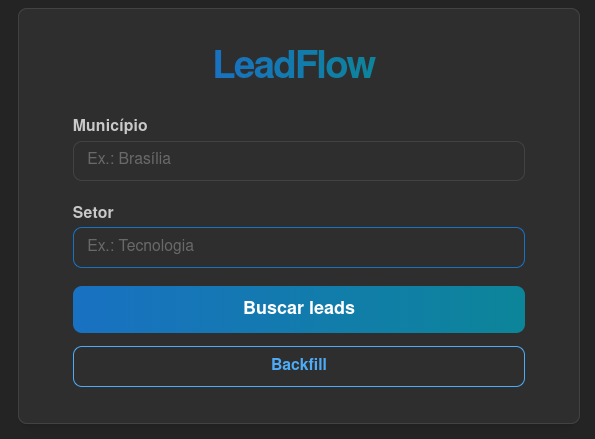

#### Busca concluída

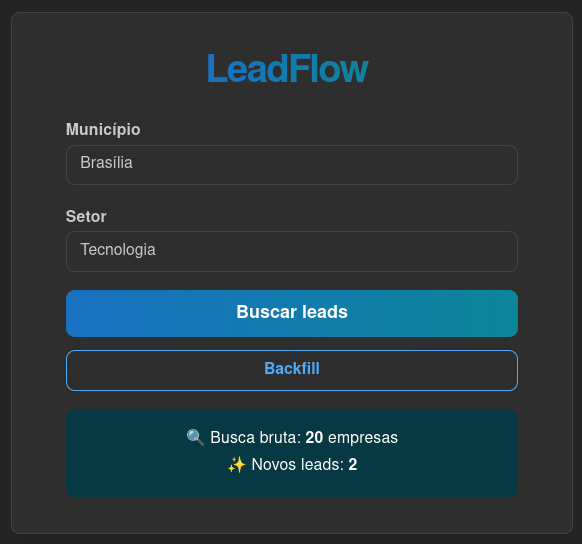

#### Backfill concluído

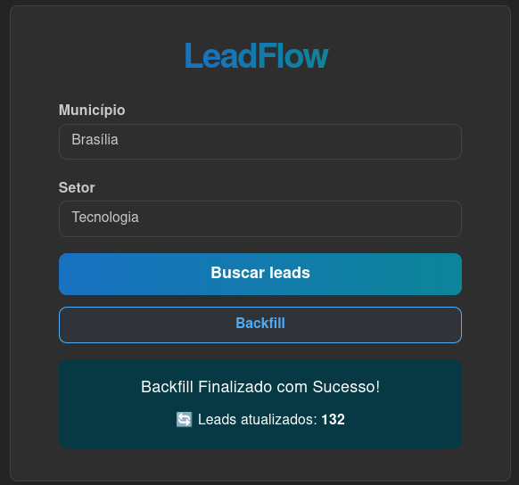

#### Tratamento de erros

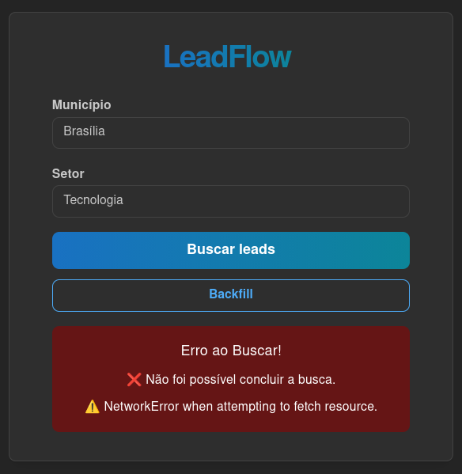

### Menu lateral

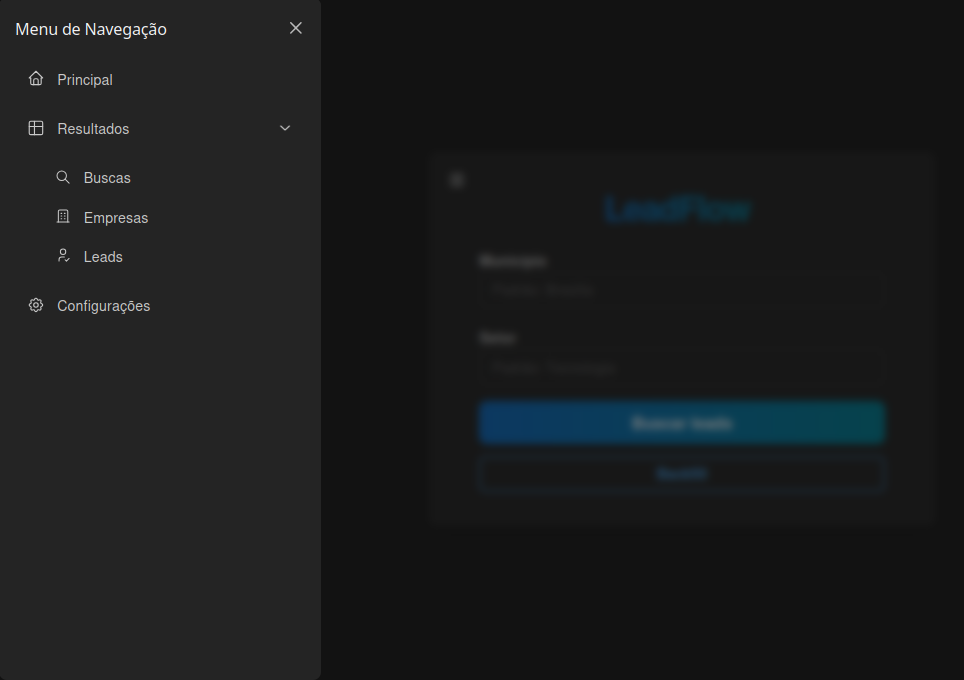

### Visualização dos resultados

#### Buscas

A tela de buscas possui:

- filtros de pesquisa;
- ordenação;
- seleção múltipla;
- visualização dos detalhes da busca;
- exclusão de buscas;
- indicador visual de status da busca;
- navegar para resultados de empresas e leads pelo menu detalhes de pesquisa;

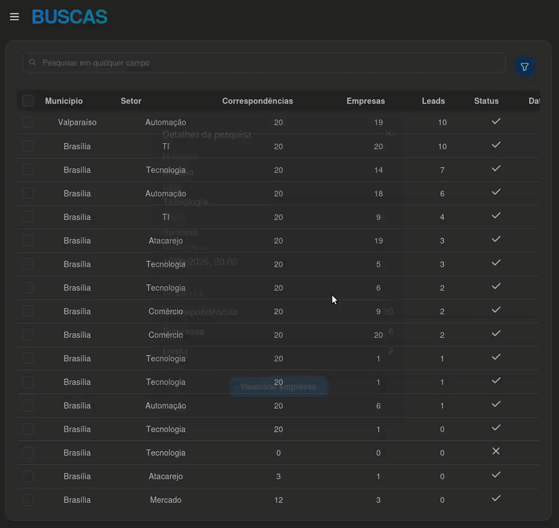

##### Menu de detalhes da busca

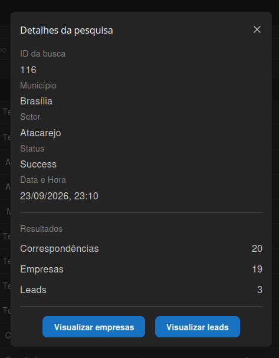

##### Menu de confirmação de exclusão da busca

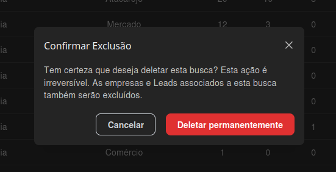

#### Empresas

A tela de empresas possui:

- filtros de pesquisa;
- ordenação;
- seleção múltipla;
- exclusão;
- visualização detalhada da empresa.
- indicador visual de presença de website

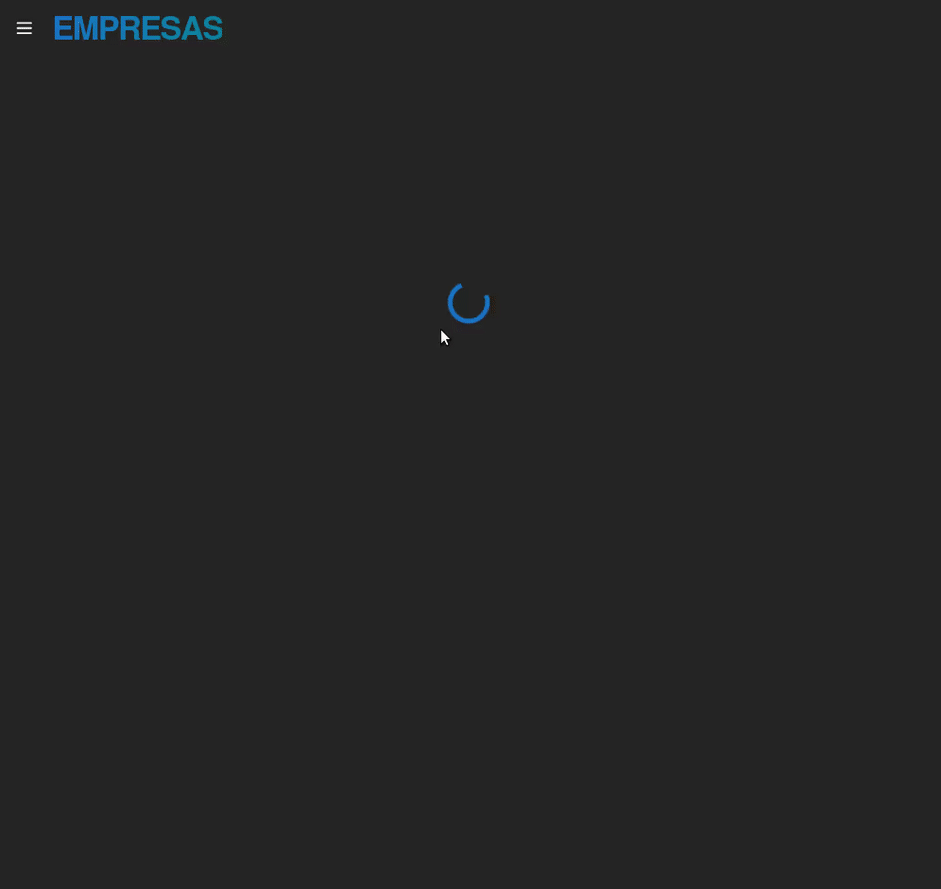

##### Menu de detalhes da empresa

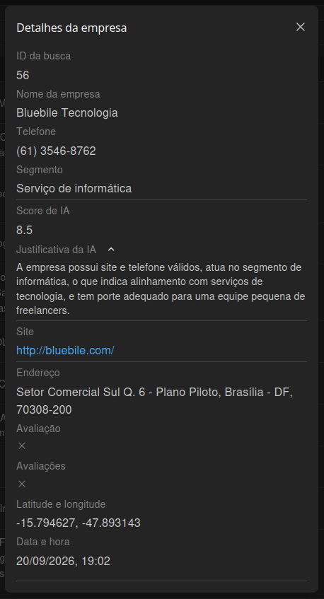

##### Menu de confirmação de exclusão da empresa

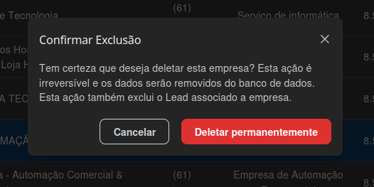

#### Leads

A tela de leads funciona como uma visão de **oportunidades qualificadas**. O usuário pode:

- filtrar;
- ordenar;
- selecionar múltiplos leads;
- excluir leads;
- clicar em um lead para visualizar os detalhes da **Company associada**.

Leads não possuem uma tela de detalhes própria: a Company é a fonte de verdade dos dados da empresa.

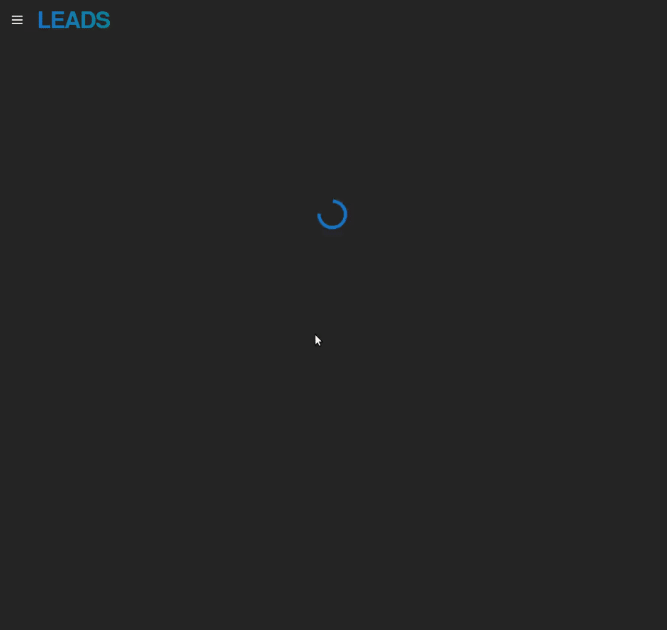

##### Menu de confirmação de exclusão do lead

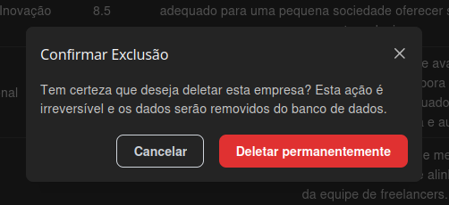

---

## O que o LeadFlow faz?

O fluxo principal começa com dois parâmetros:

```text
Município + Segmento
```

A partir deles, o sistema:

1. Cria e persiste uma nova `Search` com status inicial `Processing`.
2. Consulta o histórico de buscas com o mesmo município e segmento.
3. Usa as empresas já encontradas nessas buscas como contexto para a **exclusão inteligente** da coleta.
4. Consulta a SerpAPI utilizando resultados locais.
5. Remove empresas já existentes no banco e duplicatas do próprio lote.
6. Normaliza os dados coletados.
7. Resolve e valida websites.
8. Persiste as novas `Company` no PostgreSQL.
9. Classifica as empresas com IA.
10. Gera registros de `Lead` a partir das empresas qualificadas.
11. Persiste os leads no PostgreSQL.
12. Atualiza os totais e o status da `Search`.

A arquitetura possui duas formas de deduplicação relacionadas, mas com responsabilidades diferentes:

* **Exclusão inteligente da coleta:** considera empresas associadas a buscas anteriores com o mesmo município e segmento e utiliza esses nomes como contexto para a consulta externa, buscando evitar a repetição de resultados e ampliar a quantidade de empresas novas encontradas em pesquisas subsequentes.

  **Observação:** nos testes realizados durante o desenvolvimento, a exclusão não se mostrou excessivamente agressiva e apresentou comportamento útil para ampliar a diversidade dos resultados entre pesquisas sucessivas.

- **Deduplicação do processamento:** compara os resultados recebidos com todas as empresas já persistidas, garantindo que uma empresa não seja salva novamente mesmo que ela apareça em outra combinação de busca.

### Backfill

O sistema também possui um **Backfill**, responsável por reprocessar registros existentes e preencher ou atualizar dados que ficaram incompletos ou que podem ser recalculados, como:

- score da IA;
- justificativa da IA;
- websites;
- demais dados enriquecidos.

O Backfill também pode **criar novos registros de `Lead`**. Se uma empresa já existente passar a atender aos critérios de qualificação durante uma reavaliação e ainda não possuir um Lead associado, o sistema cria esse Lead e o persiste no PostgreSQL.

### PostgreSQL como fonte central

O PostgreSQL é a fonte central de persistência da aplicação.

Isso mantém a lógica de negócio independente de mecanismos de apresentação e fornece uma base adequada para consultas, relacionamentos, integridade referencial e evolução futura da aplicação.

---

# Arquitetura

A aplicação está organizada em camadas para separar interface, API, regras de negócio, persistência e integrações externas.

```text
                         ┌──────────────────────┐
                         │      Frontend        │
                         │   React + Mantine    │
                         └──────────┬───────────┘
                                    │
                                  HTTP
                                    ▼
                         ┌──────────────────────┐
                         │       FastAPI        │
                         │       REST API       │
                         └──────────┬───────────┘
                                    │
                                    ▼
                         ┌──────────────────────┐
                         │    LeadFlow Core     │
                         │      Services        │
                         └──────────┬───────────┘
                                    │
                ┌───────────────────┼───────────────────┐
                │                   │                   │
                ▼                   ▼                   ▼
        ┌──────────────┐    ┌───────────────┐   ┌──────────────┐
        │  SerpAPI     │    │ DataProcessor │   │ Repositórios │
        │ Google Local │    │               │   │              │
        └──────────────┘    └───────┬───────┘   └──────┬───────┘
                                    │                  │
                     ┌──────────────┼──────────────┐   │
                     │              │              │   │
                     ▼              ▼              ▼   ▼
              ┌──────────────┐ ┌────────────┐ ┌──────────────┐
              │WebsiteResolver│ │CompanyScorer│ │ Deduplicação │
              │    🌐 Site   │ │    IA 🤖   │ │  & Backfill  │
              └──────────────┘ └────────────┘ └──────────────┘
                                                      │
                                                      ▼
                                              ┌──────────────┐
                                              │  PostgreSQL  │
                                              │   Database   │
                                              └──────────────┘
```

## Princípios da arquitetura

- **FastAPI** expõe a aplicação como API HTTP.
- **Services** orquestram os casos de uso.
- **DataProcessor** concentra transformação, deduplicação, enriquecimento, classificação e Backfill.
- **Repositories** isolam o acesso ao PostgreSQL.
- **PostgreSQL** mantém os dados relacionais da aplicação.
- **SerpAPI** fornece os dados externos utilizados na coleta.
- **CompanyScorer** adiciona a classificação baseada em IA.
- **WebsiteResolver** resolve e normaliza os endereços dos sites das empresas e também é utilizado durante o Backfill.
- **Models** definem os contratos de dados utilizados pela aplicação.
- **Main / endpoints** recebem as requisições HTTP e encaminham as operações para os services.

---

# Fluxos principais

## Fluxo de busca

```text
Usuário
   │
   │ Município + Segmento
   ▼
React
   │
   │ POST /search-companies
   ▼
FastAPI
   │
   ▼
LeadFlow Service
   │
   ├── Cria Search (Processing)
   │
   ├── Busca Searches anteriores
   │        │
   │        └── mesmo município + segmento
   │
   ├── Recupera Companies relacionadas
   │        │
   │        └── nomes usados na exclusão inteligente
   │
   ▼
CompanyCollector
   │
   ▼
SerpAPI
   │
   ▼
Dados brutos
   │
   ▼
DataProcessor
   │
   ├── Deduplicação global
   ├── Normalização
   ├── Resolução de website
   └── Classificação com IA
   │
   ▼
CompanyRepository
   │
   ▼
PostgreSQL
   │
   ▼
Geração de Leads
   │
   ▼
LeadRepository
   │
   ▼
PostgreSQL
   │
   ▼
SearchRepository
   │
   └── atualiza totais + status
```

O fluxo de busca diferencia o **status da execução** do **resultado da coleta**. Uma busca pode terminar com status `Success` mesmo que a fonte externa não tenha retornado empresas; o status representa a execução da operação, não a quantidade de resultados. Portanto, se uma busca é salva com status Processing, isso indica que houve uma falha durante o processamento e não foi possivel atribuir um valor de sucesso ou erro.

O ciclo de status utilizado é:

```text
Processing
    │
    ├──────────────► Success
    │
    └──────────────► Error
```

---

## Fluxo de Backfill

```text
Usuário
   │
   │ clique em Backfill
   ▼
React
   │
   │ POST /backfill
   ▼
FastAPI
   │
   ▼
LeadFlow Service
   │
   ▼
PostgreSQL
   │
   ├── Companies
   └── Leads
   │
   ▼
DataProcessor
   │
   ├── Reprocessamento das Companies
   ├── Reavaliação com IA
   ├── Resolução de websites
   └── Verificação de novas qualificações
             │
             └── Company qualificada sem Lead
                         │
                         ▼
                    LeadRepository
                         │
                         ▼
                     PostgreSQL
```

O Backfill permite evoluir o conjunto de dados sem executar novamente toda a etapa de coleta externa.

---

## Fluxo de visualização de um Lead

A tabela de Leads funciona como uma visão resumida das oportunidades. O Lead não possui uma tela de detalhes própria.

Quando o usuário clica em uma linha:

```text
LeadTable
   │
   │ ids dos Leads
   ▼
POST /companies-from-leads
   │
   ▼
LeadRepository
   │
   └── encontra os company_id correspondentes
   │
   ▼
CompanyRepository
   │
   └── busca as Companies pelos IDs
   │
   ▼
CompanyDetailsMenu
```

O endpoint aceita uma lista de IDs mesmo quando apenas um Lead é selecionado. Isso mantém o contrato preparado para uma futura visualização múltipla.

Essa abordagem mantém a `Company` como **fonte de verdade dos detalhes da empresa**. Se novos dados forem adicionados à entidade `Company`, a visualização originada a partir de um Lead continuará utilizando os mesmos detalhes da Company, sem duplicar a estrutura do Lead.

---

# Backend

O backend concentra a lógica de coleta, processamento, persistência e exposição da API.

## API

A API é construída com **FastAPI** e possui rotas para busca, Backfill, consultas, detalhes, exclusões e navegação entre Leads e Companies.

### Busca e Backfill

#### `POST /search-companies`

Executa uma nova busca de empresas.

#### Request

```json
{
  "municipio": "Brasília",
  "setor": "Tecnologia"
}
```

#### `POST /backfill`

Reprocessa os dados existentes no PostgreSQL.

---

### Buscas

#### `GET /searches`

Retorna as buscas persistidas.

#### `POST /searches-details`

Recebe uma lista de IDs e retorna os detalhes das buscas correspondentes.

#### Exemplo de request

```json
{
  "ids": [108, 125]
}
```

#### `DELETE /delete-searches`

Remove buscas selecionadas.

A exclusão de uma `Search` também remove as `Company` associadas e, por consequência, os `Lead` dessas Companies através das regras de exclusão em cascata descritas na seção de relacionamentos.

---

### Companies

#### `GET /companies`

Retorna as empresas persistidas.

#### `POST /companies-details`

Recebe uma lista de IDs e retorna os detalhes das Companies correspondentes.

#### Exemplo de request

```json
{
  "ids": [41, 42, 43]
}
```

#### `DELETE /delete-companies`

Remove Companies selecionadas.

Ao remover uma Company, o Lead associado também é removido pela restrição `ON DELETE CASCADE`.

---

### Leads

#### `GET /leads`

Retorna os Leads persistidos para visualização na interface.

#### `DELETE /delete-leads`

Remove Leads selecionados sem remover a Company correspondente.

#### `POST /companies-from-leads`

Recebe IDs de Leads e retorna as Companies associadas.

#### Request

```json
{
  "ids": [7, 12, 15]
}
```

O processamento é:

```text
Lead IDs
   ↓
LeadRepository
   ↓
Company IDs
   ↓
CompanyRepository
   ↓
Companies
```

---

## Tratamento de erros

Erros encontrados durante a execução do pipeline são propagados pelo service até a camada da API.

O FastAPI converte as exceções em respostas HTTP estruturadas, permitindo que o frontend apresente a mensagem retornada pela API.

Exemplo:

```json
{
  "detail": "Erro ao buscar empresas: ..."
}
```

No frontend, respostas HTTP fora da faixa de sucesso são interpretadas e exibidas nos componentes de feedback.

O fluxo evita esconder erros operacionais e facilita o diagnóstico durante o uso da aplicação.

---

# Coleta de dados

A classe `CompanyCollector` é responsável pela comunicação com a SerpAPI.

Suas principais responsabilidades são:

- construir a consulta;
- considerar município e segmento;
- adicionar critérios de exclusão contextual quando aplicável;
- consultar a SerpAPI;
- obter resultados locais;
- retornar os dados brutos da fonte externa.

A coleta permanece separada do processamento para evitar o acoplamento direto entre o formato retornado pela fonte externa e os modelos internos da aplicação.

## SerpAPI

A SerpAPI foi escolhida como fonte principal do MVP.

O projeto utiliza o mecanismo:

```text
google_local
```

Os resultados podem fornecer:

- nome da empresa;
- telefone;
- categoria/segmento;
- website;
- avaliação;
- quantidade de avaliações;
- endereço;
- latitude;
- longitude;
- links relacionados.

### Por que SerpAPI?

- retorno estruturado;
- integração simples;
- resultados locais;
- busca por município e segmento;
- evita scraping direto da interface do Google Maps.

---

# Processamento dos dados

A classe `DataProcessor` atua como camada intermediária entre a coleta e os modelos utilizados pela aplicação.

## Exclusão inteligente e deduplicação

O sistema possui duas estratégias complementares.

### Exclusão contextual da coleta

Antes de uma nova busca, o sistema procura `Searches` anteriores com o mesmo:

```text
município + segmento
```

As `Companies` associadas a essas buscas são utilizadas para construir exclusões na consulta externa.

O objetivo é reduzir a recorrência das mesmas empresas entre buscas semelhantes.

### Deduplicação global

Mesmo com a exclusão contextual, a resposta externa ainda passa por uma deduplicação independente.

O `DataProcessor` compara os resultados coletados com **todas as Companies já persistidas**, impedindo que uma empresa existente seja salva novamente por uma nova busca.

A separação das duas estratégias permite que a coleta tenha um contexto de busca sem transformar esse contexto em uma regra de persistência.

## Responsabilidades do DataProcessor

- extrair nomes existentes;
- normalizar dados utilizados na comparação;
- identificar duplicatas;
- remover empresas já armazenadas;
- remover duplicatas dentro do próprio lote;
- construir objetos `Company`;
- resolver websites;
- classificar empresas com IA;
- gerar objetos `Lead` a partir das empresas qualificadas;
- realizar o processo de Backfill.

A lógica de processamento permanece independente da camada de armazenamento.

---

# Classificação com IA

O componente `CompanyScorer` avalia empresas e produz:

- `ia_score`;
- `ia_justificativa`.

Fluxo:

```text
Company
   │
   ▼
CompanyScorer 🤖
   │
   ▼
ScoreOutput
   │
   ├── ia_score
   └── justificativa
```

A classificação funciona como uma camada adicional de qualificação. Depois da avaliação, empresas que atendem aos critérios definidos pelo sistema podem originar registros de `Lead`.

## Critérios utilizados pela IA

A avaliação utiliza o seguinte contexto:

```text
Você é um especialista em prospecção comercial e qualificação de leads B2B.

Os leads analisados serão utilizados por uma pequena sociedade que busca
oportunidades de freelas e projetos na área de automação e tecnologia.
Portanto, não avalie apenas a maturidade ou o tamanho da empresa.

Seu objetivo é identificar empresas que representem boas oportunidades
comerciais para uma equipe pequena oferecer seus serviços.

Considere os seguintes critérios:
- Possuir site e telefone válidos facilita o contato e aumenta o potencial do lead.
- Empresas com alguma presença digital e atividade estabelecida podem representar boas oportunidades.
- Empresas muito grandes, extremamente consolidadas ou com forte estrutura podem não ser ideais para uma pequena equipe de freelancers.
- Empresas pequenas ou médias podem receber uma pontuação maior quando demonstrarem potencial para contratar serviços externos.
- A ausência de site ou de telefone reduz a facilidade de prospecção e deve diminuir o score.
- Avaliação e quantidade de avaliações devem ser usadas apenas como indicadores de presença e maturidade do negócio, não como critério absoluto de qualidade.
- Analise exclusivamente as informações fornecidas. Não invente características, necessidades ou problemas da empresa.

Atribua uma pontuação de 0.0 a 10.0 representando o potencial comercial
desse lead para a pequena sociedade.

Além da pontuação, forneça uma justificativa curta, objetiva e baseada
exclusivamente nos dados fornecidos.
```

---

# Modelo de dados

O modelo relacional separa os dados da empresa dos dados específicos da oportunidade.

## Search

Representa uma execução de busca realizada pelo usuário.

Principais campos:

- `id`
- `municipio`
- `setor`
- `total_correspondencias`
- `total_empresas`
- `total_leads`
- `search_status`
- `timestamp`

O `search_status` representa o ciclo da execução:

```text
Processing → Success
Processing → Error
```

---

## Company

Representa a empresa coletada e seus dados cadastrais e enriquecidos.

Principais campos:

- `id`
- `search_id`
- `nome_empresa`
- `telefone`
- `segmento`
- `ia_score`
- `ia_justificativa`
- `site`
- `avaliacao`
- `quantidade_avaliacoes`
- `endereco`
- `latitude`
- `longitude`
- `timestamp`

A `Company` é a fonte de verdade para os detalhes da empresa exibidos no sistema.

---

## Lead

Representa uma oportunidade derivada de uma `Company` qualificada.

Principais campos:

- `id`
- `company_id`
- `ia_score`
- `ia_justificativa`


O `Lead` não duplica os dados cadastrais da Company. Ele referencia a empresa através de `company_id` e mantém os dados específicos da qualificação.

---

## Projeções de consulta

Além dos modelos de domínio, o backend possui modelos utilizados para representar resultados específicos de consultas.

Por exemplo, `LeadResult` pode combinar informações próprias do Lead com dados selecionados da Company por meio de `JOIN`, sem transformar essas informações em novos atributos persistidos no Lead.

Essa separação permite que:

- a tabela `leads` permaneça simples;
- a Company continue sendo a fonte de verdade dos seus próprios dados;
- as consultas retornem exatamente as informações necessárias para cada tela.

---

# Relacionamentos e exclusão em cascata

O relacionamento entre as entidades é:

```text
Search
  │
  │ 1 : N
  ▼
Company
  │
  │ 1 : 0..1
  ▼
Lead
```

### Regras do relacionamento

- Uma `Search` pode gerar várias `Company`.
- Uma `Company` pertence a uma `Search`.
- Uma `Company` pode não possuir Lead ou possuir exatamente um Lead.
- Um `Lead` pertence a uma Company.

A relação `Company → Lead` é limitada a no máximo um Lead por Company através de uma restrição `UNIQUE` em `leads.company_id`.

## Por que usar exclusão em cascata?

As entidades dependentes não fazem sentido isoladamente dentro do domínio:

- uma `Company` pertence a uma `Search`;
- um `Lead` representa uma oportunidade derivada de uma `Company`.

Por isso, quando uma entidade pai é excluída, seus registros dependentes também devem ser removidos.

A integridade é garantida pelo próprio PostgreSQL através de chaves estrangeiras com `ON DELETE CASCADE`.

### `Search → Company`

```sql
search_id BIGINT NOT NULL
    REFERENCES searches(id)
    ON DELETE CASCADE
```

Ao excluir uma `Search`, suas `Company` são removidas automaticamente.

### `Company → Lead`

```sql
company_id BIGINT NOT NULL UNIQUE
    REFERENCES companies(id)
    ON DELETE CASCADE
```

Ao excluir uma `Company`, seu `Lead` associado é removido automaticamente.

### Efeito da cascata

```text
DELETE Search
     │
     ▼
  Company
     │
     ▼
    Lead
```

Ou, diretamente:

```text
DELETE Company
     │
     ▼
    Lead
```

Por outro lado:

```text
DELETE Lead
```

**não remove a Company**, pois a dependência existe no sentido contrário.

Essa decisão evita registros órfãos e elimina a necessidade de a aplicação implementar manualmente a ordem de exclusão dos registros relacionados.

---

# Armazenamento

A camada `src/backend/data_storage` concentra os componentes responsáveis pela persistência.

Estrutura atual:

```text
data_storage/
├── company_repository.py
├── database.py
├── lead_repository.py
└── search_repository.py
```

## PostgreSQL

O PostgreSQL é o armazenamento principal da aplicação.

Os repositories isolam operações de:

- **Create** — inserção de registros;
- **Read** — consulta dos registros;
- **Update** — atualização dos registros;
- **Delete** — exclusão dos registros.

---

# Frontend

O frontend utiliza:

- **React**
- **Vite**
- **Mantine**
- **@tabler/icons-react**

A interface atualmente permite:

- informar município;
- informar segmento/setor;
- executar uma busca;
- executar o Backfill;
- exibir estados de carregamento;
- bloquear novas interações durante operações em andamento;
- exibir histórico de buscas;
- exibir empresas;
- exibir Leads;
- filtrar resultados;
- ordenar resultados;
- selecionar múltiplas linhas;
- excluir registros selecionados;
- visualizar detalhes de buscas;
- visualizar detalhes de Companies;
- navegar de um Lead para a Company associada;
- exibir estados de erro e sucesso.

## Componentização

A interface foi dividida em páginas e componentes para manter a responsabilidade de cada parte explícita.

Estrutura resumida:

```text
src/frontend/src/
├── App.jsx
├── main.jsx
├── pages/
│   ├── SearchResults.jsx
│   ├── CompanyResults.jsx
│   └── LeadResults.jsx
└── components/
    ├── SideMenu.jsx
    ├── principal/
    │   ├── LeadFlowHeader.jsx
    │   ├── SearchForm.jsx
    │   └── FeedbackAlert.jsx
    └── results/
        ├── DeleteMenu.jsx
        ├── details/
        │   ├── CompanyDetailsMenu.jsx
        │   └── SearchDetailsMenu.jsx
        └── tables/
            ├── CompanyTable.jsx
            ├── LeadTable.jsx
            └── SearchTable.jsx
```

### `LeadFlowHeader`

Responsável pela identidade visual do LeadFlow.

### `SearchForm`

Responsável pelos campos de município e setor e pelas ações de busca e Backfill.

### `FeedbackAlert`

Responsável pelo feedback visual das operações, diferenciando estados de sucesso e erro.

### `SearchTable`

Exibe o histórico de buscas, permitindo filtro, ordenação, seleção, exclusão e abertura do menu de detalhes da busca.

### `CompanyTable`

Exibe Companies com filtro, ordenação, seleção, exclusão e visualização detalhada.

### `LeadTable`

Exibe as oportunidades qualificadas. O clique em uma linha não abre um detalhe próprio de Lead: ele solicita ao backend a Company associada e abre o mesmo fluxo de detalhes utilizado na tela de Companies.

### `SearchDetailsMenu`

Exibe os detalhes de uma busca e permite navegar para as Companies relacionadas.

### `CompanyDetailsMenu`

Exibe os dados detalhados da Company.

### `DeleteMenu`

Centraliza o componente de confirmação das operações de exclusão.

---

# Como usar

## Pré-requisitos

- Python 3.10+
- Node.js / npm
- Docker
- Docker Compose
- Chave da SerpAPI
- Credenciais necessárias para o Gemini

## 1. Clone o projeto

```bash
git clone <URL_DO_REPOSITORIO>
cd LeadFlow
```

## 2. Suba o PostgreSQL

O projeto utiliza Docker Compose para executar o banco PostgreSQL.

```bash
docker compose up -d
```

Verifique se o container do banco está em execução antes de iniciar o backend.

## 3. Configure o backend

O ambiente Python fica dentro de `src/backend`.

```bash
cd src/backend
python -m venv .venv
source .venv/bin/activate
pip install -r requirements.txt
```

Volte para a raiz do projeto antes de iniciar a API:

```bash
cd ../..
```

## 4. Configure as credenciais

Use `.env.example` como referência para criar o `.env` com as variáveis necessárias.

> **Nunca versione credenciais reais, chaves de API ou arquivos `.env`.**

## 5. Execute o backend

Na raiz do projeto:

```bash
uvicorn src.backend.main:app --reload
```

A API será disponibilizada em:

```text
http://127.0.0.1:8000
```

A documentação interativa do FastAPI:

```text
http://127.0.0.1:8000/docs
```

## 6. Execute o frontend

Em outro terminal:

```bash
cd src/frontend
npm install
npm run dev
```

O Vite informará no terminal o endereço local da aplicação.

## 7. Usando o LeadFlow

Na interface:

1. informe o município;
2. informe o segmento;
3. clique em **Buscar leads**.

O sistema executará o pipeline e exibirá o resultado ao final da operação.

O botão **Backfill** executa o reprocessamento dos dados já armazenados.

Durante operações em andamento, a interface bloqueia novas interações para evitar execuções concorrentes.

---

# Configuração

Os arquivos de exemplo esperados pelo projeto são:

```text
.env.example
```

Esse arquivo serve como referência para a configuração local.

As credenciais reais devem permanecer fora do controle de versão.

---

# Tecnologias

## Backend

- Python
- FastAPI
- Uvicorn
- Pydantic
- SerpAPI
- PostgreSQL
- psycopg2
- Google Gemini
- python-dotenv
- pytest

## Frontend

- React
- Vite
- Mantine
- @tabler/icons-react

## Infraestrutura

- Docker
- Docker Compose

---

# Alternativas avaliadas

Durante o desenvolvimento, outras abordagens de obtenção de dados foram avaliadas.

## Gemini com Grounding × Google Places API

| Critério | Gemini com Grounding | Google Places API |
| :--- | :--- | :--- |
| **Tipo de busca** | Consultas mais flexíveis e contextuais. | Buscas estruturadas por palavras-chave, categorias e localização. |
| **Volume de dados** | Adequado para listas menores e mais selecionadas. | Mais adequado para grandes volumes e paginação. |
| **Formato de saída** | Pode produzir Markdown, tabelas ou JSON. | Retorna dados estruturados para processamento. |
| **Velocidade** | Pode ser mais lento devido ao processamento do modelo. | Resposta direta da API. |

A implementação atual utiliza a **SerpAPI** como principal fonte de coleta.

---

# Web Scraping

## Google Maps

O Google Maps apresenta desafios para automação direta:

- conteúdo dinâmico;
- dados que podem não estar disponíveis no HTML inicial;
- mecanismos de proteção contra automação;
- possíveis CAPTCHAs e bloqueios;
- restrições associadas aos termos de uso da plataforma.

Ferramentas como Selenium podem automatizar um navegador, mas aumentam a complexidade e o custo computacional.

Por esse motivo, o MVP utiliza a **SerpAPI** em vez de realizar scraping direto do Google Maps.

---

# Estrutura do projeto

```text
LeadFlow/
├── src/
│   ├── backend/
│   │   ├── main.py
│   │   ├── models/
│   │   ├── services/
│   │   │   └── leadflow_service.py
│   │   ├── data_collect/
│   │   ├── data_process/
│   │   ├── data_storage/
│   │   ├── tests/
│   │   └── requirements.txt
│   │
│   └── frontend/
│       ├── src/
│       │   ├── App.jsx
│       │   ├── main.jsx
│       │   ├── pages/
│       │   └── components/
│       ├── package.json
│       └── package-lock.json
│
├── .env.example
├── .gitignore
├── docker-compose.yml
└── README.md
```

---

# Próximos passos

O MVP já cobre o fluxo principal de coleta, processamento, persistência, qualificação e exploração dos dados. As próximas evoluções podem ser escolhidas pelo impacto que trazem ao produto.

- [ ] Implementar paginação para conjuntos maiores de dados.
- [ ] Adicionar visualização múltipla de Companies e Leads.
- [ ] Adicionar indicador visual para Leads novos ou ainda não visualizados.
- [ ] Criar menu de configurações para gerenciamento de chaves e variáveis do sistema.
- [ ] Expandir a navegação entre **Searches → Companies → Leads** e os caminhos de retorno.
- [ ] Empacotar a aplicação para facilitar a distribuição ao usuário final.

---

# Status

🚧 **MVP operacional**

O LeadFlow atualmente integra coleta de dados, processamento, classificação por IA, persistência relacional, API e interface web em um único fluxo operacional.

O MVP já consegue:

- coletar empresas através da SerpAPI;
- registrar o histórico das buscas;
- manter o status de execução das buscas;
- evitar empresas já existentes;
- aplicar exclusão contextual para buscas semelhantes;
- deduplicar resultados;
- normalizar dados;
- resolver e validar websites;
- classificar empresas utilizando IA;
- gerar Leads a partir das empresas qualificadas;
- manter o relacionamento `Search → Company → Lead`;
- aplicar exclusão em cascata no banco;
- persistir Companies e Leads em PostgreSQL;
- reprocessar registros existentes através do Backfill;
- criar novos Leads durante o Backfill quando uma Company passa a ser qualificada;
- expor o pipeline através de uma API FastAPI;
- consumir a API através de uma interface React;
- filtrar e ordenar resultados;
- selecionar e excluir múltiplos registros;
- visualizar detalhes de Searches e Companies;
- navegar de Leads para a Company associada;
- exibir estados de loading e feedback de sucesso/erro.

O projeto segue em evolução, com foco em melhorar a exploração dos dados, ampliar o enriquecimento e transformar o MVP em uma ferramenta de prospecção mais completa.
